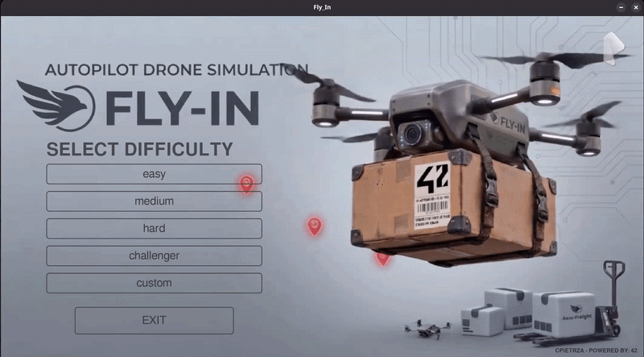
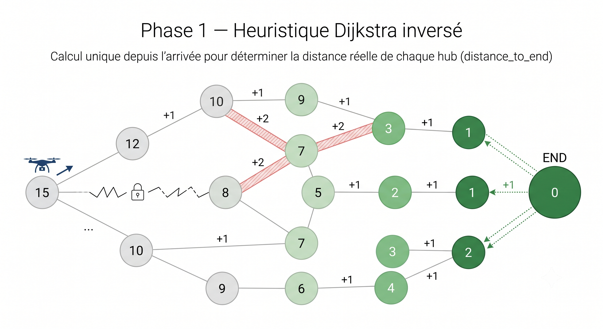
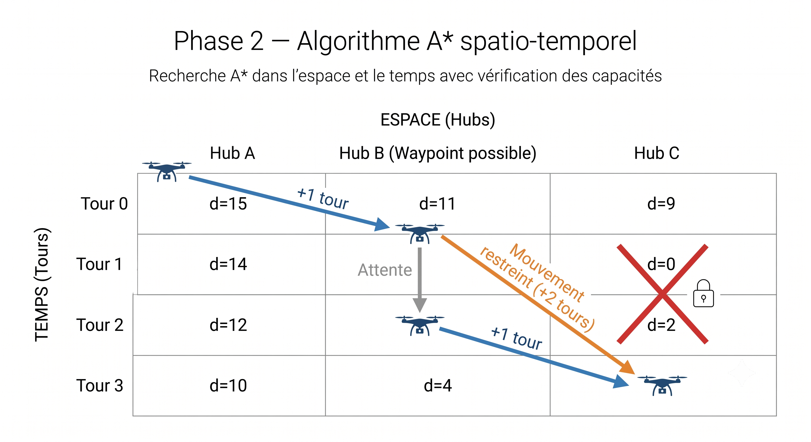
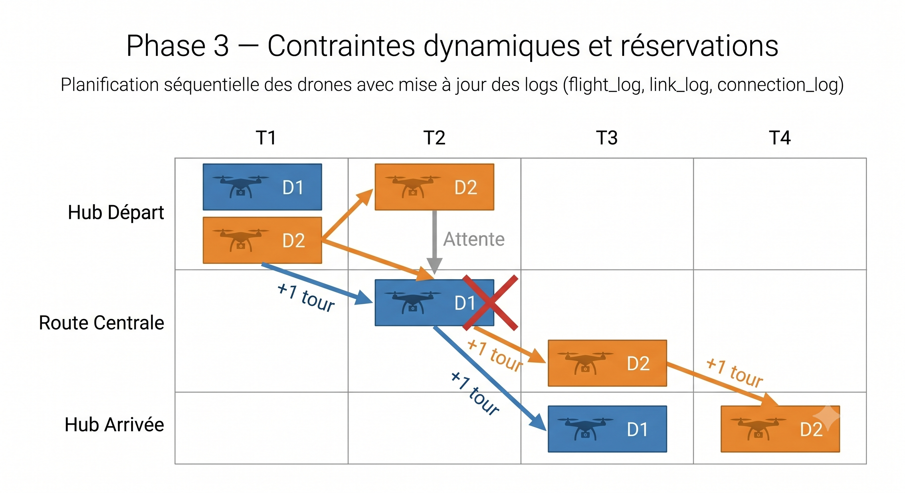
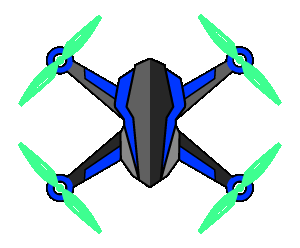
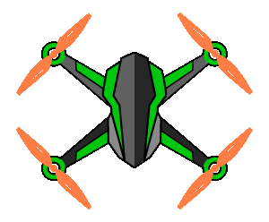
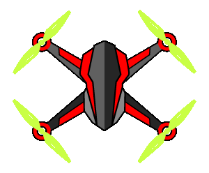
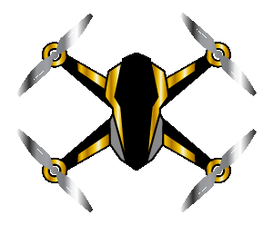
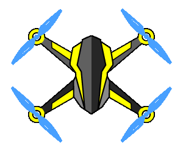
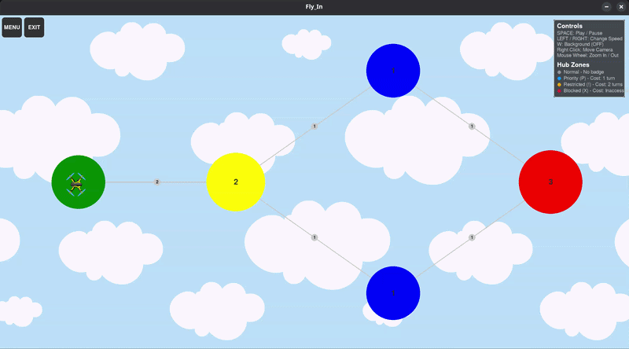

# ✈️ Fly-In — Simulateur de Trafic de Drones

*This project has been created as part of the 42 curriculum by cpietrza.*

<center></center>

---

## 📋 Table des matières

- [Description](#-description)
- [Algorithme & Implémentation](#-algorithme--implémentation)
- [Représentation Visuelle](#-représentation-visuelle)
- [Structure du Projet](#-structure-du-projet)
- [Format des Cartes](#-format-des-cartes)
- [Flotte de Drones](#-flotte-de-drones)
- [Raccourcis Clavier](#-raccourcis-clavier)
- [Instructions](#-instructions)
- [Commandes Makefile](#-commandes-makefile)
- [Cartes Disponibles](#-cartes-disponibles)
- [Ressources](#-ressources)

---

## 📖 Description

**Fly-In** est un simulateur de trafic de drones conçu dans le cadre du cursus 42. L'objectif est de router une flotte de drones depuis un **hub de départ** jusqu'à un **hub d'arrivée** à travers un réseau de zones interconnectées, tout en respectant les contraintes de capacité à chaque tour.

Le simulateur résout automatiquement le problème de routage et joue une animation visuelle en temps réel de tous les mouvements de drones, incluant l'évitement des collisions, les contraintes de zones et la gestion des congestions.

### Fonctionnalités principales

- 🗺️ **Format de carte personnalisé** — définissez vos propres réseaux de zones dans de simples fichiers `.txt`
- 🤖 **Solveur automatique** — algorithme A* avec espace d'états étendu dans le temps
- 🎮 **Visualiseur interactif** — rendu Pygame en temps réel avec zoom, panoramique et contrôle de vitesse
- 🚫 **Types de zones** — zones Normale, Prioritaire, Restreinte et Bloquée avec des coûts de traversée différents
- 📊 **Sortie de simulation** — affichage console pas-à-pas au format standardisé (section VII.5 du sujet)
- ✅ **Validation des cartes** — validation Pydantic complète avec des messages d'erreur lisibles

---

## 🧠 Algorithme & Implémentation

Le solveur est implémenté dans [`solver.py`](solver.py) sous forme d'une seule classe : `TrafficController`.
Il fonctionne en **3 phases** pour router tous les drones du départ à l'arrivée en respectant toutes les contraintes.

---

### 🟦 Phase 1 — Dijkstra Inversé (Précalcul de l'Heuristique)

<center></center>

**Ce que ça fait :** Avant de chercher le chemin d'un drone, le solveur exécute une recherche de Dijkstra en partant du **hub d'arrivée** et en remontant à travers tout le graphe.

**Pourquoi :** Cela nous donne, pour chaque hub, le nombre minimum de tours nécessaires pour atteindre la destination. Cette valeur est stockée dans `distance_to_end` et utilisée comme heuristique `h(s)` dans A*. Comme elle utilise les vrais coûts de zones (et non des estimations à vol d'oiseau), elle ne surestime jamais — rendant A* à la fois optimal et efficace.

**Point d'entrée dans le code :** `compute_dijkstra()` dans `solver.py`.

Chaque hub possède un type de zone qui détermine combien de tours il coûte pour y entrer :

| Zone        | Symbole | Coût | Signification                         |
|-------------|---------|------|---------------------------------------|
| Normale     | —       | `1`  | Traversée standard                    |
| Prioritaire | `P`     | `1`  | Coût standard, préféré                |
| Restreinte  | `!`     | `2`  | Nécessite 2 tours pour traverser      |
| Bloquée     | `X`     | `∞`  | Inaccessible — ignorée                |

> Cette phase s'exécute **une seule fois**, avant qu'un drone soit planifié. Son résultat est réutilisé pour chaque drone.

---

### 🟩 Phase 2 — A\* Spatiotemporel (Recherche de Chemin)

<center></center>

**Ce que ça fait :** Pour chaque drone, le solveur trouve le chemin optimal en utilisant A*. L'idée clé est que l'état inclut non seulement le hub, mais aussi le tour actuel :

```
state = (hub_name, turn)
```

Cela permet à l'algorithme de raisonner sur *quand* un drone se trouve quelque part, pas seulement *où*.

**État initial :** `(hub_départ, 0)`
**Objectif :** tout état `(hub_arrivée, T)` pour n'importe quel tour `T`

Chaque déplacement crée un nouvel état :

```
# Se déplacer de A vers B avec un coût de zone c :
(A, t)  ──►  (B, t + c)

# Attendre en A (interdit sur les waypoints) :
(A, t)  ──►  (A, t + 1)
```

**Formule de score :** `f(s) = g(s) + h(s)`

```
g(s) = coût réel accumulé
     = g(parent) + coût_zone + pénalité_attente + pénalité_recul

h(s) = coût estimé restant
     = distance_to_end[hub_suivant]  (depuis la Phase 1)
```

| Pénalité             | Valeur | Quand appliquée                                        |
|----------------------|--------|--------------------------------------------------------|
| `pénalité_attente`   | `1e-6` | Le drone reste sur le même hub                         |
| `pénalité_recul`     | `2.0`  | Le hub suivant est plus loin du but que le hub actuel  |

**Fonctions d'aide utilisées dans `compute_a_star()` :**

- `get_previous_hub()` — retrouve le hub depuis lequel le drone est arrivé, pour éviter de revenir immédiatement
- `get_possible_neighbors()` — liste tous les hubs suivants accessibles (voisins + option d'attente)
- `is_hub_full()` — vérifie si le hub de destination a de la capacité pour le drone
- `is_route_full()` — vérifie si le lien entre deux hubs a de la capacité
- `calculate_penalties()` — calcule les pénalités d'attente et de recul
- `reconstruct_path()` — remonte le chemin complet une fois l'arrivée atteinte

**Waypoints :** Pour chaque connexion `A–B`, un nœud intermédiaire virtuel `wp_A_B` est créé au milieu. Cela permet au solveur de suivre les drones *en transit* sur un lien séparément des drones *à un hub*, permettant des vérifications précises des capacités sur les zones restreintes qui prennent 2 tours à traverser.

```
A  ──►  wp_A_B  ──►  B
```

---

### 🟥 Phase 3 — Contraintes Dynamiques & Réservations

<center></center>

**Ce que ça fait :** Cette phase empêche les collisions et gère le routage de plusieurs drones l'un après l'autre.

#### Suivi des Capacités

Trois dictionnaires suivent combien de drones occupent chaque emplacement à chaque tour :

```python
flight_log[(hub, tour)]            # combien de drones sont à ce hub à ce tour
link_log[(hub_a, hub_b, tour)]     # combien de drones sont sur ce lien à ce tour
connection_log[(clé_conn, tour)]   # comptage bidirectionnel (évite le double-comptage)
```

Avant d'explorer un déplacement, le solveur appelle `is_hub_full()` et `is_route_full()` pour rejeter tout déplacement qui dépasserait une limite de capacité. Cela garantit qu'**aucun état invalide n'est jamais exploré**.

#### Routage Séquentiel des Drones

Les drones sont routés **un par un** dans l'ordre `D0, D1, D2, ...`. Après que le chemin de chaque drone est trouvé par `compute_a_star()`, la fonction `get_traffic_plan()` valide son chemin complet dans `flight_log`, `link_log` et `connection_log`. Le drone suivant planifie alors son trajet **en tenant compte de tous les drones précédemment validés**.

Cette approche séquentielle est `O(N × A*)` — bien plus gérable que la planification conjointe — et produit des solutions valides et quasi-optimales en pratique.

#### Limite de Sécurité

Si A* ne peut pas trouver un chemin en 2000 tours, il retourne `None` et `get_traffic_plan()` lève une `ValueError`. L'interface graphique intercepte cette erreur et affiche un message lisible au lieu de planter.

---

## 🎨 Représentation Visuelle

Le visualiseur (`generator_map.py` + `game.py`) utilise **Pygame** pour offrir une simulation interactive riche.

### Rendu des Hubs

Chaque hub est dessiné comme un cercle coloré. Son rayon est proportionnel à sa capacité `max_drones` — les hubs plus grands sont visuellement plus imposants. Des badges de zone sont affichés au centre du hub :

| Zone        | Badge | Couleur de l'anneau     |
|-------------|-------|-------------------------|
| Normale     | —     | Couleur assignée au hub |
| Prioritaire | `P`   | Anneau bleu             |
| Restreinte  | `!`   | Anneau orange           |
| Bloquée     | `X`   | Anneau rouge            |

### Animation des Drones

Les drones sont des sprites animés qui s'interpolent fluidement entre les hubs. Chaque drone se voit attribuer aléatoirement l'un des cinq modèles de couleur. Ils pivotent vers leur destination et leurs hélices tournent plus vite en mouvement. Pendant les pauses entre tours, les drones planent sur place avec une rotation lente des hélices, et la parallaxe de fond se fige également.

### Connexions

Les connexions sont dessinées sous forme de lignes entre les hubs. Un petit badge au milieu indique la capacité du lien (`max_link_capacity`). L'épaisseur de la ligne augmente pour les liens à plus haute capacité.

### Info-bulle (Survol)

Survoler un hub ou une connexion affiche une info-bulle en temps réel :
- **Info-bulle hub** : nom du hub, nombre de drones actuels vs capacité, liste des IDs de drones présents
- **Info-bulle connexion** : nom de la connexion, nombre en transit vs capacité, IDs des drones en transit
- Les drones ayant **terminé** au hub d'arrivée sont également suivis et affichés dans l'info-bulle

### Parallaxe de Fond

Une animation de parallaxe nuageuse multi-couches joue en arrière-plan. Elle est synchronisée avec le mouvement des drones — elle défile uniquement pendant la phase de mouvement de chaque tour et se met en pause pendant les pauses entre tours, correspondant exactement au cycle d'animation des drones.

### Panneau de Légende

Une légende permanente est affichée dans le coin supérieur droit montrant :
- Les raccourcis clavier avec leur état en direct (ex. `W: Background (ON)`)
- Les types de zones de hub avec leur indicateur de couleur et leur description de coût

### Écran de Fin

Quand tous les drones atteignent l'objectif, une fenêtre popup affiche :
- Nom de la carte
- Nombre total de drones
- Nombre total de tours effectués

---

## 📁 Structure du Projet

```
Fly-In/
├── fly-in.py              # Point d'entrée
├── game.py                # Boucle de jeu principale, caméra, UI, info-bulles, légende
├── generator_map.py       # Sprites Pygame : VisualNode, VisualDrone, GraphRenderer
├── solver.py              # TrafficController : Dijkstra + A* pathfinding
├── simulation_output.py   # Formatage de la sortie console (format VII.5)
├── parser.py              # Parseur de fichiers cartes & validation Pydantic
├── structure.py           # Structures de données : Node, Hub, Start, End, Connection, Drone
├── menu.py                # Menu principal, sélecteur de cartes, boutons animés
├── converter.py           # Convertisseur GIF vers frames Pygame
├── Makefile               # Commandes de build, lint, exécution
├── pyproject.toml         # Dépendances Python (uv)
├── assets/                # Images, sprites de drones, GIFs, fonds nuageux
└── maps/
    ├── easy/              # 3 cartes débutant
    ├── medium/            # 3 cartes intermédiaires
    ├── hard/              # 3 cartes avancées
    ├── challenger/        # 1 carte extrême
    └── custom/            # Cartes personnalisées & de test (dont cas d'erreur)
```

---

## 🗺️ Format des Cartes

Les cartes sont de simples fichiers `.txt`. Voici un exemple complet :

```
# Mon titre de carte
nb_drones: 3

start_hub: depart 0 0 [color=green max_drones=5]
hub: relais 1 0 [color=blue max_drones=2 zone=priority]
hub: danger 2 0 [color=red  zone=restricted]
end_hub: arrivee 3 0 [color=green max_drones=5]

connection: depart-relais [max_link_capacity=2]
connection: relais-danger
connection: danger-arrivee
```

### Référence de Syntaxe

| Mot-clé         | Description                                              |
|-----------------|----------------------------------------------------------|
| `nb_drones: N`  | Nombre de drones à router                                |
| `start_hub:`    | La zone de départ unique                                 |
| `end_hub:`      | La zone d'arrivée unique                                 |
| `hub:`          | Une zone intermédiaire                                   |
| `connection:`   | Un lien bidirectionnel entre deux hubs (`A-B`)           |

### Options des Hubs `[...]`

| Option                  | Défaut  | Description                                  |
|-------------------------|---------|----------------------------------------------|
| `color=<nom>`           | grey    | Couleur d'affichage                          |
| `max_drones=N`          | 1       | Nombre max de drones simultanés dans le hub  |
| `zone=normal`           | normal  | Type de zone (voir tableau des coûts)        |

### Options des Connexions `[...]`

| Option                  | Défaut | Description                                       |
|-------------------------|--------|---------------------------------------------------|
| `max_link_capacity=N`   | 1      | Nombre max de drones simultanés sur le lien       |

### Couleurs Disponibles

`yellow` `grey` `red` `orange` `brown` `blue` `green` `pink` `cyan`
`purple` `lime` `magenta` `gold` `black` `maroon` `darkred` `violet`
`crimson` `rainbow`

---

## 🚁 Flotte de Drones

Chaque drone se voit attribuer aléatoirement l'un des cinq modèles visuels au début de la simulation :

| Modèle  | Couleur | Aperçu |
|---------|---------|--------|
| Bleu    | 🔵 |  |
| Vert    | 🟢 |  |
| Rouge   | 🔴 |  |
| Or      | 🟡 |  |
| Jaune   | 💛 |  |

---

## ⌨️ Raccourcis Clavier

Ces raccourcis sont disponibles pendant la simulation et sont également affichés dans le **panneau de légende en jeu** (coin supérieur droit) :

| Touche              | Action                                                        |
|---------------------|---------------------------------------------------------------|
| `ESPACE`            | Lancer / Mettre en pause la simulation                        |
| `→` Flèche droite   | Augmenter la vitesse (`×1` → `×2` → `×4` → `×8`)             |
| `←` Flèche gauche   | Diminuer la vitesse (`×8` → `×4` → `×2` → `×1`)              |
| `W`                 | Activer/Désactiver l'animation de parallaxe (ON/OFF)          |
| Clic droit + Glisser| Déplacer la caméra                                            |
| Molette de souris   | Zoom avant / Zoom arrière                                     |

---

## 🎮 Démo de Simulation

<center></center>

---

## ⚙️ Instructions

### Prérequis

- Python **≥ 3.12**
- [`uv`](https://docs.astral.sh/uv/) — gestionnaire de paquets Python rapide

### Installer uv

```bash
curl -Lsf https://astral.sh/uv/install.sh | sh
```

### Installer les dépendances

```bash
make install
```

### Lancer le simulateur

```bash
make run
```

### Vérifications de style

```bash
make lint
```

### Vérifications de style strictes

```bash
make lint-strict
```

### Lancer en mode débogage

```bash
make debug
```

### Nettoyer les fichiers temporaires

```bash
make clean
```

---

## 🛠️ Commandes Makefile

| Commande           | Description                                                          |
|--------------------|----------------------------------------------------------------------|
| `make install`     | Installe toutes les dépendances Python via `uv sync`                 |
| `make run`         | Lance le simulateur                                                  |
| `make lint`        | Exécute `mypy` (typage) + `flake8` (style)                           |
| `make lint-strict` | Exécute `mypy --strict` + `flake8` (vérification de types renforcée) |
| `make debug`       | Lance le simulateur sous le débogueur `pdb`                          |
| `make clean`       | Supprime `.venv`, `__pycache__`, `.mypy_cache`, `uv.lock`            |

---

## 🗂️ Cartes Disponibles

### 🟢 Facile

| Fichier                 | Description                                     |
|-------------------------|-------------------------------------------------|
| `01_linear_path.txt`    | Chemin linéaire simple, sans contraintes        |
| `02_simple_fork.txt`    | Première bifurcation pour choisir un chemin     |
| `03_basic_capacity.txt` | Introduction aux limites de capacité            |

### 🟡 Intermédiaire

| Fichier                  | Description                                          |
|--------------------------|------------------------------------------------------|
| `01_dead_end_trap.txt`   | Impasse pouvant attirer les drones hors du chemin    |
| `02_circular_loop.txt`   | Structure en boucle nécessitant une planification soignée |
| `03_priority_puzzle.txt` | Mélange de types de zones et de limites de capacité  |

### 🔴 Difficile

| Fichier                    | Description                                       |
|----------------------------|---------------------------------------------------|
| `01_maze_nightmare.txt`    | Labyrinthe complexe avec de nombreuses impasses   |
| `02_capacity_hell.txt`     | Capacité très restreinte sur chaque lien          |
| `03_ultimate_challenge.txt`| Grande carte combinant tous les types de contraintes |

### 💀 Challenger

| Fichier                       | Description                                        |
|-------------------------------|----------------------------------------------------|
| `01_the_impossible_dream.txt` | Carte extrême poussant le solveur à ses limites    |

---

## 📚 Ressources

### Références Techniques

- [Pygame — Tutoriel YouTube](https://www.youtube.com/watch?v=8J8wWxbAdFg&list=PLMS9Cy4Enq5KsM7GJ4LHnlBQKTQBV8kaR)
- [Documentation Pygame](https://www.pygame.org/docs/)
- [Recherche A* — YouTube](https://www.youtube.com/watch?v=lSzElQ2Belk)
- [Comprendre A* — YouTube](https://www.youtube.com/watch?v=i0x5fj4PqP4)
- [Algorithme A* — Wikipédia](https://en.wikipedia.org/wiki/A*_search_algorithm)
- [Gestionnaire uv — YouTube](https://www.youtube.com/watch?v=3WJ40TYi83c)

### Utilisation de l'IA

| Tâche                         | Détails                                                                       |
|-------------------------------|-------------------------------------------------------------------------------|
| **Débogage de l'algorithme**  | Identification des cas limites dans l'espace d'états A* étendu dans le temps  |
| **Corrections de bugs**       | Divers correctifs dans le solveur et le parseur                               |
| **Qualité du code**           | Résolution des erreurs `mypy --strict` et `flake8` dans tous les fichiers     |
| **Refactorisation du code**   | Découpage de `solver.py` en fonctions d'aide clairement nommées               |
| **Conception de cartes**      | Génération de cartes de test complexes (labyrinthe extrême, labyrinthe hardcore) |
| **README**                    | Rédaction et restructuration de ce document                                   |

> L'IA a été utilisée comme assistant de pair-programmation. Tout le code généré a été relu, compris et adapté par l'auteur du projet.
