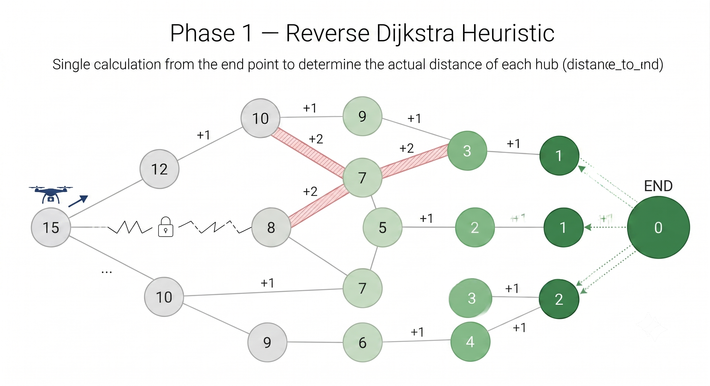
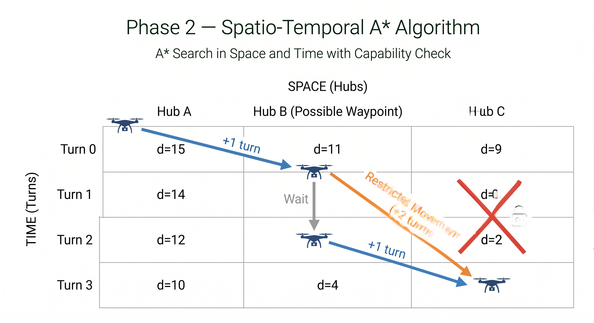
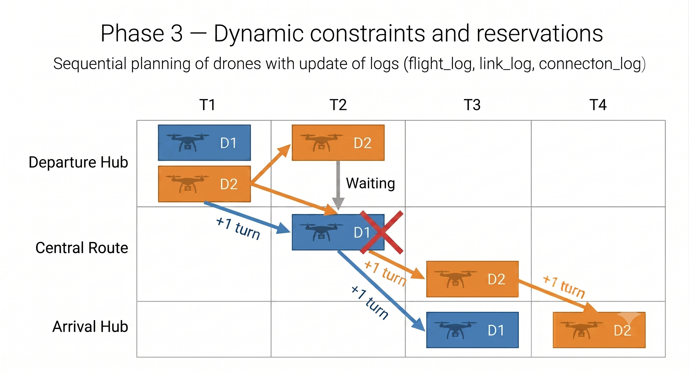

# ✈️ Fly-In — Drone Traffic Simulator

*This project has been created as part of the 42 curriculum by cpietrza.*

<center></center>

---

## 📋 Table of Contents

- [Description](#-description)
- [Algorithm & Implementation](#-algorithm--implementation)
- [Visual Representation](#-visual-representation)
- [Project Structure](#-project-structure)
- [Map Format](#-map-format)
- [Drone Fleet](#-drone-fleet)
- [Keyboard Shortcuts](#-keyboard-shortcuts)
- [Instructions](#-instructions)
- [Makefile Commands](#-makefile-commands)
- [Available Maps](#-available-maps)
- [Resources](#-resources)

---

## 📖 Description

**Fly-In** is a drone traffic simulation tool built as part of the 42 curriculum. The goal is to route a fleet of drones from a **start hub** to an **end hub** through a network of interconnected hubs and connections, while respecting capacity constraints at every step.

The simulator automatically solves the routing problem and plays a real-time visual animation of all drone movements, including collision avoidance, zone constraints, and congestion management.

### Key Features

- 🗺️ **Custom map format** — define your own hub networks in simple `.txt` files
- 🤖 **Automatic solver** — A* pathfinding with time-expanded state space
- 🎮 **Interactive visualizer** — real-time Pygame rendering with zoom, pan, and speed control
- 🚫 **Zone types** — Normal, Priority, Restricted, and Blocked zones with different traversal costs
- 📊 **Simulation output** — step-by-step console output in standardized format (section VII.5 of the subject)
- ✅ **Map validation** — full Pydantic validation with helpful error messages for invalid maps

---

## 🧠 Algorithm & Implementation

The solver is implemented in [`solver.py`](solver.py) as a single class: `TrafficController`.
It works in **3 phases** to route all drones from start to end while respecting all constraints.

---

### 🟦 Phase 1 — Reverse Dijkstra (Heuristic Precomputation)

<center></center>

**What it does:** Before finding any drone path, the solver runs a Dijkstra search starting from the **end hub** and going backwards through the entire graph.

**Why:** This gives us, for every hub, the minimum number of turns needed to reach the destination. This value is stored in `distance_to_end` and used as the heuristic `h(s)` in A*. Because it uses real zone costs (not straight-line estimates), it never overestimates — making A* both optimal and efficient.

**Code entry point:** `compute_dijkstra()` in `solver.py`.

Each hub has a zone type that determines how many turns it costs to enter:

| Zone       | Symbol | Cost | Meaning                          |
|------------|--------|------|----------------------------------|
| Normal     | —      | `1`  | Standard traversal               |
| Priority   | `P`    | `1`  | Standard cost, preferred         |
| Restricted | `!`    | `2`  | Requires 2 turns to pass through |
| Blocked    | `X`    | `∞`  | Cannot be entered — skipped      |

> This phase runs **once**, before any drone is planned. Its result is reused for every drone.

---

### 🟩 Phase 2 — Spatiotemporal A\* (Pathfinding)

<center></center>

**What it does:** For each drone, the solver finds the optimal path using A*. The key idea is that the state includes not just the hub, but also the current turn:

```
state = (hub_name, turn)
```

This lets the algorithm reason about *when* a drone is somewhere, not just *where*.

**Initial state:** `(start_hub, 0)`
**Goal:** any state `(end_hub, T)` for any turn `T`

Each move creates a new state:

```
# Moving from A to B with zone cost c:
(A, t)  ──►  (B, t + c)

# Waiting at A (not allowed on waypoints):
(A, t)  ──►  (A, t + 1)
```

**Score formula:** `f(s) = g(s) + h(s)`

```
g(s) = real cost so far
     = g(parent) + zone_cost + wait_penalty + backtrack_penalty

h(s) = estimated cost remaining
     = distance_to_end[next_hub]  (from Phase 1)
```

| Penalty             | Value  | When applied                                     |
|---------------------|--------|--------------------------------------------------|
| `wait_penalty`      | `1e-6` | Drone stays at the same hub                      |
| `backtrack_penalty` | `2.0`  | Next hub is further from the goal than current   |

**Helper functions used inside `compute_a_star()`:**

- `get_previous_hub()` — finds the hub the drone came from, to avoid going back immediately
- `get_possible_neighbors()` — lists all reachable next hubs (neighbors + wait option)
- `is_hub_full()` — checks if the destination hub has capacity for the drone
- `is_route_full()` — checks if the link between two hubs has capacity
- `calculate_penalties()` — computes the wait and backtrack penalties
- `reconstruct_path()` — traces back the full path once the end is reached

**Waypoints:** For every connection `A–B`, a virtual intermediate node `wp_A_B` is created at the midpoint. This allows the solver to track drones that are *in transit* on a link separately from drones *at a hub*, enabling precise capacity checks on restricted zones that take 2 turns to cross.

```
A  ──►  wp_A_B  ──►  B
```

---

### 🟥 Phase 3 — Dynamic Constraints & Reservations

<center></center>

**What it does:** This phase prevents collisions and manages multiple drones routing one after another.

#### Capacity Tracking

Two dictionaries track how many drones occupy each location at each turn:

```python
flight_log[(hub, turn)]           # how many drones are at this hub at this turn
link_log[(hub_a, hub_b, turn)]    # how many drones are on this link at this turn
connection_log[(conn_key, turn)]  # bidirectional link count (prevents double-booking)
```

Before exploring a move, the solver calls `is_hub_full()` and `is_route_full()` to reject any move that would exceed a capacity limit. This ensures **no invalid state is ever explored**.

#### Sequential Drone Routing

Drones are routed **one by one** in order `D0, D1, D2, ...`. After each drone's path is found by `compute_a_star()`, the function `get_traffic_plan()` commits its full path to `flight_log`, `link_log`, and `connection_log`. The next drone then plans its route **around all previously committed drones**.

This greedy sequential approach is `O(N × A*)` — far more tractable than joint planning — and produces valid, near-optimal solutions in practice.

#### Safety Limit

If A* cannot find a path within 2000 turns, it returns `None` and `get_traffic_plan()` raises a `ValueError`. The UI catches this and shows a readable error instead of crashing.

---

## 🎨 Visual Representation

The visualizer (`generator_map.py` + `game.py`) uses **Pygame** to provide a rich interactive simulation.

### Hub Rendering

Each hub is drawn as a colored circle. Its radius scales with its `max_drones` capacity — larger hubs are visually bigger. Zone badges are displayed in the center of the hub:

| Zone       | Badge | Ring color             |
|------------|-------|------------------------|
| Normal     | —     | Hub's assigned color   |
| Priority   | `P`   | Blue outer ring        |
| Restricted | `!`   | Orange outer ring      |
| Blocked    | `X`   | Red outer ring         |

### Drone Animation

Drones are animated sprites that interpolate smoothly between hubs. Each drone is randomly assigned one of five color variants. They rotate to face their destination and their propellers spin faster while in motion. During inter-turn pauses, drones hover in place with slow propeller rotation and the background parallax also freezes.

### Connections

Connections are drawn as lines between hubs. A small badge in the middle shows the link's capacity (`max_link_capacity`). The line thickness increases for higher-capacity links.

### Tooltip (Hover Info)

Hovering over any hub or connection shows a real-time tooltip:
- **Hub tooltip**: hub name, current drone count vs capacity, list of drone IDs present
- **Connection tooltip**: connection name, current transit count vs capacity, drone IDs in transit
- Drones that have **finished** at the end hub are also tracked and shown in the tooltip

### Background Parallax

A multi-layer cloud parallax animation plays in the background. It is synchronized with drone movement — it scrolls only during the movement phase of each turn and pauses during inter-turn gaps, exactly matching the drone animation cycle.

### Legend Panel

A persistent legend is displayed in the top-right corner showing:
- Keyboard shortcuts with live state (e.g., `W: Background (ON)`)
- Hub zone types with their color indicator and cost description

### End Screen

When all drones reach the goal, a popup displays:
- Map name
- Total drones
- Total turns taken

---

## 📁 Project Structure

```
Fly-In/
├── fly-in.py              # Entry point
├── game.py                # Main game loop, camera, UI, tooltip, legend
├── generator_map.py       # Pygame sprites: VisualNode, VisualDrone, GraphRenderer
├── solver.py              # TrafficController: Dijkstra + A* pathfinding
├── simulation_output.py   # Console output formatting (VII.5 format)
├── parser.py              # Map file parser & Pydantic validation
├── structure.py           # Data structures: Node, Hub, Start, End, Connection, Drone
├── menu.py                # Main menu, map selector, animated buttons
├── converter.py           # GIF-to-Pygame frame converter
├── Makefile               # Build, lint, run commands
├── pyproject.toml         # Python dependencies (uv)
├── assets/                # Images, drone sprites, GIFs, cloud backgrounds
└── maps/
    ├── easy/              # 3 beginner maps
    ├── medium/            # 3 intermediate maps
    ├── hard/              # 3 advanced maps
    ├── challenger/        # 1 extreme map
    └── custom/            # Custom & test maps (including error cases)
```

---

## 🗺️ Map Format

Maps are plain `.txt` files. Here is a complete example:

```
# My map title
nb_drones: 3

start_hub: start 0 0 [color=green max_drones=5]
hub: waypoint 1 0 [color=blue max_drones=2 zone=priority]
hub: danger  2 0 [color=red  zone=restricted]
end_hub: goal 3 0 [color=green max_drones=5]

connection: start-waypoint [max_link_capacity=2]
connection: waypoint-danger
connection: danger-goal
```

### Syntax Reference

| Keyword         | Description                                             |
|-----------------|---------------------------------------------------------|
| `nb_drones: N`  | Number of drones to route                               |
| `start_hub:`    | The unique departure zone                               |
| `end_hub:`      | The unique arrival zone                                 |
| `hub:`          | An intermediate zone                                    |
| `connection:`   | A bidirectional link between two hubs (`A-B`)           |

### Hub Options `[...]`

| Option                  | Default   | Description                          |
|-------------------------|-----------|--------------------------------------|
| `color=<name>`          | grey      | Display color                        |
| `max_drones=N`          | 1         | Max simultaneous drones in the hub   |
| `zone=normal`           | normal    | Zone type (see cost table above)     |

### Connection Options `[...]`

| Option                  | Default | Description                                |
|-------------------------|---------|---------------------------------------------|
| `max_link_capacity=N`   | 1       | Max simultaneous drones on the link        |

### Available Colors

`yellow` `grey` `red` `orange` `brown` `blue` `green` `pink` `cyan`
`purple` `lime` `magenta` `gold` `black` `maroon` `darkred` `violet`
`crimson` `rainbow`

---

## 🚁 Drone Fleet

Each drone is randomly assigned one of five visual models at the start of the simulation:

| Model  | Color | Preview |
|--------|-------|---------|
| Blue   | 🔵 |  |
| Green  | 🟢 |  |
| Red    | 🔴 |  |
| Gold   | 🟡 |  |
| Yellow | 💛 |  |

---

## ⌨️ Keyboard Shortcuts

These shortcuts are available during simulation and are also displayed in the **in-game legend panel** (top-right corner):

| Key               | Action                                                   |
|-------------------|----------------------------------------------------------|
| `SPACE`           | Play / Pause the simulation                              |
| `→` Right Arrow   | Increase simulation speed (`×1` → `×2` → `×4` → `×8`)  |
| `←` Left Arrow    | Decrease simulation speed (`×8` → `×4` → `×2` → `×1`)  |
| `W`               | Toggle background parallax animation (ON/OFF)            |
| Right Click + Drag| Pan / move the camera                                    |
| Mouse Wheel       | Zoom in / Zoom out                                       |

---

## 🎮 Simulation Demo

<center></center>

---

## ⚙️ Instructions

### Requirements

- Python **≥ 3.12**
- [`uv`](https://docs.astral.sh/uv/) — fast Python package manager

### Install uv

```bash
curl -Lsf https://astral.sh/uv/install.sh | sh
```

### Install dependencies

```bash
make install
```

### Run the simulator

```bash
make run
```

### Run linting checks

```bash
make lint
```

### Run strict linting checks

```bash
make lint-strict
```

### Run the application in debug mode

```bash
make debug
```

### Clean application files

```bash
make clean
```

---

## 🛠️ Makefile Commands

| Command            | Description                                                        |
|--------------------|--------------------------------------------------------------------|
| `make install`     | Install all Python dependencies via `uv sync`                      |
| `make run`         | Launch the simulator                                               |
| `make lint`        | Run `mypy` (type checking) + `flake8` (style)                      |
| `make lint-strict` | Run `mypy --strict` + `flake8` (stricter type checking)            |
| `make debug`       | Launch the simulator under `pdb` debugger                          |
| `make clean`       | Remove `.venv`, `__pycache__`, `.mypy_cache`, `uv.lock`            |

---

## 🗂️ Available Maps

### 🟢 Easy

| File                    | Description                              |
|-------------------------|------------------------------------------|
| `01_linear_path.txt`    | Simple straight line, no constraints     |
| `02_simple_fork.txt`    | First fork to choose a path              |
| `03_basic_capacity.txt` | Introduction to capacity limits          |

### 🟡 Medium

| File                     | Description                               |
|--------------------------|-------------------------------------------|
| `01_dead_end_trap.txt`   | Dead-end that can lure drones off course  |
| `02_circular_loop.txt`   | Loop structure requiring careful planning |
| `03_priority_puzzle.txt` | Mix of zone types and capacity limits     |

### 🔴 Hard

| File                       | Description                                  |
|----------------------------|----------------------------------------------|
| `01_maze_nightmare.txt`    | Complex maze with many dead ends             |
| `02_capacity_hell.txt`     | Highly restricted capacity on every link     |
| `03_ultimate_challenge.txt`| Large map combining all constraint types     |

### 💀 Challenger

| File                          | Description                                   |
|-------------------------------|-----------------------------------------------|
| `01_the_impossible_dream.txt` | Extreme map pushing the solver to its limits  |

---

## 📚 Resources

### Technical References

- [Pygame — YouTube tutorial](https://www.youtube.com/watch?v=8J8wWxbAdFg&list=PLMS9Cy4Enq5KsM7GJ4LHnlBQKTQBV8kaR)
- [Pygame Documentation](https://www.pygame.org/docs/)
- [A* Search — YouTube](https://www.youtube.com/watch?v=lSzElQ2Belk)
- [Understanding A* — YouTube](https://www.youtube.com/watch?v=i0x5fj4PqP4)
- [A* Search Algorithm — Wikipedia](https://en.wikipedia.org/wiki/A*_search_algorithm)
- [uv package manager — YouTube](https://www.youtube.com/watch?v=3WJ40TYi83c)

### AI Usage

| Task                    | Details                                                               |
|-------------------------|-----------------------------------------------------------------------|
| **Algorithm debugging** | Identifying edge cases in the A* time-expanded state space            |
| **Bug fixes**           | Various bug fixes across the solver and parser                        |
| **Code quality**        | Resolving `mypy --strict` and `flake8` errors across all source files |
| **Code refactoring**    | Splitting `solver.py` into smaller, clearly named helper functions    |
| **Map design**          | Generating complex test maps (extreme maze, hardcore maze)            |
| **README**              | Drafting and restructuring this document                              |

> AI was used as a pair-programming assistant. All generated code was reviewed, understood, and adapted by the project author.
